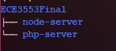

# **Multifarious Systems 1 - Final Project**

## **Modular Multi-Purpose Chat Room**


**Benjamin Luchterhand**

**David E. Nieves-Acaron**

**Fall 2020**

## **Introduction:**

-----

The goal of the project was to create a chat room that updates in real-time and is capable of saving messages to a database to be displayed whenever the chat was opened in the future. The project initially targeted deployment in a custom infrastructure with automated bots to use the chat. Some of these goals were out of reach, and will be outlined in the “Future Work” section.

## **Literature Review of Similar Projects**

-----
The first project referenced in our own project was the “Real-time chat” from serverjs.io **[1]**. This project was the inspiration behind our original project; it utilized a chat embedded into a div form that used websockets as the primary form of communication between clients connected to the server. Natively, it uses nodejs, a Javascript server utility that we ended up sticking with. Additionally, this project gave us the idea of using cookies to track users and give the user a more “stateful” experience in the chatroom. We expanded on the cookie system with a more robust login system. The guide was a complete tutorial of how to start a simple messaging system which became a sort of template.

The next system that was referenced was from a SkySilk.com blog **[2]** which contained much the same information for socket-based communication. While we ended up creating our own system for checking for new messages, we did use one line of code from the project for chat control; it simply scrolls the chat’s window down to the most recent message in the event of a new one being sent. Similar to the previous reference, this guide mirrored the use of node.js and added in the recommendation of express.js. This was not implemented.

As for the Website-PHP-InfluxDB interactivity, it cannot be underestimated how important the technique of AJAX was for this application. AJAX stands for “asynchronous javascript and XML” and it is a technique that allows one to send POST requests to a PHP web server without reloading the page. For obvious reasons, this is desirable and can even be considered mission critical for a live chat application. The informative port by Capra, R **[3]** provides detailed information on how AJAX requests work using JQuery and using that as an example to work on, the code for posting and receiving data to and from the PHP server was developed. 

The interaction between PHP and InfluxDB was conducted through the use of the InfluxDB-PHP library. As such, the GitHub repository containing the code for this library **[4]** was consulted frequently for installation instructions as well as for examples. The full details of the installation are listed in the section below. 

## **Architecture:**

-----

```
Ubuntu 18.0.4

InfluxDB 1.1.1

PHP 7.2.24-0

Chromium/Google Chrome/Firefox Web Browsers

HTML/CSS:
```


` `*Image 2: Chat Room HTML, ~/node\_server/views/index.html*

The HTML for the chat is simple; a table as a container for an image and for the chat controls and viewing window. The chat input itself is wrapped in form tags which makes a call to send the message to the database (InfluxDB).


*Images 3, 4, 5, 6: CSS, ~/node\_server/public/styles.css*

Javascript:

The project utilizes internal Javascript to power the chats. See the images below.

The internal Javascript of the same file (index.html) contains a $(document).ready function which initializes the message uploader. On submission of the form, if the string is empty, the user is notified with an alert. The author of the message is pulled from the cookie which it’s set in, and a timestamp is also taken for use in updating the chat in the future. The message is sent with a $.post() command, which thoroughly checks for errors on completion.


*Image 7: On form submission; send to InfluxDB*

Next is the login system; when the document is starting up, it checks the user’s cookies for a “current\_user”. This is important to the chat box because this username gets shown with all chat messages. If this is not set, a user is prompted to create a username. If the username does not already exist in the database, the user is prompted to register with a password. If it does exist, the user is asked to log in. If the password does not match up, the user is kicked out to the beginning of the whole process.


*Image 8: Part ½, Javascript Login System*


*Image 9: Part 2/2, Javascript Login System*

Next is the scraper for updating the chat. As mentioned in the literature review, we decided to avoid the sockets and implement our own updater. This would give us more knowledge on the system and put us in a better position to update it however we want to in the future. The next image shows this scraper’s functionality; a “latestTime” variable is set and referenced within an interval loop set to half a second. It sends this latest time checked to the server and queries for any messages that might have been submitted after that time. This ensures that all messages are collected in a timely manner. Any missed messages are returned with a bar character “|” as a separator, which is then deconstructed into the individual messages. Lastly, the “latestTime” variable is updated and the loop repeats.


*Image 10: Chat Updater/Influx Scraper*

Last of all for the Javascript is the message constructor that is called in the chat updater. This section of code extracts information from the JSON retrieved from the database. It pulls the message sent time, the author, and of course, the message itself. We’ve also implemented chat notification sounds in the form of cat meows, which is the theme of the chat. 


*Images 11 & 12: Message Constructor*

PHP:

The PHP document, found at ~/php\_server/index.php, pulls important environment variables from the system when a request is made, connects to the appropriate database using these environment variables, runs database-interactive code, and finally returns the requested data. The first image is a function of a message being sent to the database:


*Image 13: PHP to Influx Code - Pushing a Message to Influx*

The next image shows how the PHP code handles a chat update request. All chats are queried past the given “latestTime” variable that originated in the Javascript provided previously. If messages are encountered, they are combined with the bar character “|” and sent back to the Javascript for message processing:


*Image 14: PHP - Receiving new messages from Influx*


Next is the login system; it simply then connects to the login table, ensures that all of the necessary information is present, and loads the information into InfluxDB.


*Image 14: Registering a new user*

Last of all, we have a small block of code which simply logs into a new user. It checks that a username and password was sent and if so, compares the given password to the one in the database:


*Image 15: Log into an existing user*

Influx:

Schema, Table, Interactions - (Design choices/examples of each)

The design for the message schema is as follows: 

```
{​

measurement: 'message',​

fields: ​

{ ​

'length': int​

value:  str​

},​

tags ​

{​

'from': str​

'to': str​

'message': str​

},​

time: long​

​

}
```

The reasoning behind this schema design is due to the way that InfluxDB holds data. All data to be written to InfluxDB requires a measurement name, fields, tags, and a timestamp. The measurement name in this case corresponds to “message”. Although the fields are usually used for numerical values, we decided to include the length of the string (for any future applications) as well as the actual string itself (denoted as value). The tags usually include metadata about the measurement, which is why we included the “from” address, the “to” address, and the message itself in the tags. Finally, the timestamp is a Unix timestamp corresponding to the number of seconds since January 1, 1970 UTC. This timestamp is marked as when the message was processed in the PHP server.


```
{​​

measurement: 'username',​​

fields: ​

{ ​​

'value':  str​

},​​

tags: ​

{​

'name': str​

'password': str​

}​,​

time: long​

}​​
```

This measurement schema corresponds to the usernames and associated passwords stored in InfluxDB. As can be seen here, the only field corresponds to the value of the username itself. The tags include the username and the password of the user. Finally, the timestamp marks when the PHP server processed this user and thus can also serve as a marker for when the username was created. 

## **Functionality/Example: (full diagram attached in .zip file)**


Example:
Logging in for the first time


Entering a username


Entering one’s password


(password visible for debugging purposes)


Password attempt successful


Example of getting the password wrong:


Example of registering a new user


Typing messages


Message can now be seen.


Examples of different perspectives depending on who the user is (one is signed in from Chromium, and the other from Firefox):


“Sign Out” button is available for erasing the “user” cookie and logging out.


Additional “Click to Meow” button that plays a meow sound every time a new message (not by a user) is submitted. 


## **Setup:**

How do we set up the system? What commands?

The directory tree looks like this:



1. Install Composer

```php -r "copy('<https://getcomposer.org/installer>', 'composer-setup.php');"```

1. Install php-curl

```sudo apt-get install -y php5-curl```

1. Install InfluxDB-PHP using composer

```composer require influxdb/influxdb-php```

1. Run the node server inside of the node-server directory

```sudo node node-server/index.js```

1. Export the following environment variables with their corresponding values in your setup. The default values will be shown.
```
export INFLUX\_HOST=localhost

export INFLUX\_PORT=8086

export INFLUX\_USER=root

export INFLUX\_PSSWD=root
```
1. Run the PHP server inside of the php-server directory

```
cd php-server

sudo php -S localhost:8080	

```

## **Future Work**

-----
Our future intentions are to create a simple video streaming service with this live chat sat beside it. The video would replace the gif of the cat, and the login system would be made to be more robust, with encryption and the proper security protocols in place. We would also like to replace our updating system with a socket-based system. 

David and I are research assistants and have spent the better part of the year building a cloud agnostic server infrastructure. It was our intention of hosting this system on that architecture to make the system not only scalable, but templateable. This would mean that new chats could pop up in response to system demand. This was not implemented simply because of time constraints, however, this would be as simple as containerizing our existing code and hosting it in the infrastructure in the near future.

## **Team Member Contributions:**

-----
*Benjamin Luchterhand (Team Leader, ~45%):*

1. Original project concept with working Javascript chat
1. Login System/Cookies
1. Node.js
1. HTML/CSS (initial)

*David Nieves-Acaron (~55%):*

1. PHP Server
1. InfluxDB
1. Message Read/Write
1. HTML/CSS (adapted)


Bibliography

-----

**[1]** Chat real-time - server.js. (n.d.). Retrieved November 30, 2020, from <https://serverjs.io/tutorials/chat/>

**[2]** How to Create A Real-Time Chat App with Node.js. (2020, January 17). Retrieved from https://www.skysilk.com/blog/2018/create-real-time-chat-app-nodejs/

**[3]** Capra, R. (Spring 2013). *Lecture 10 – Ajax and JQuery*. UNC School of Information and Library Science. Retrieved Fall 2020, from https://ils.unc.edu/courses/2013\_spring/inls760\_001/lect10/lect10.pdf

**[4]** InfluxDB. (n.d.). InfluxDB-PHP. GitHub. https://github.com/influxdata/influxdb-php


